# Studio Hub

**A suite of single-file developer tools that run entirely in your browser** — no install, no accounts, no server, and nothing ever leaves your machine.

### → [Open Studio Hub](https://rajathpi.github.io/studio-hub/)

Every browser-only tool runs straight from that link — no clone, no build step. Or download the files and open `index.html` from disk; they behave identically, including offline.

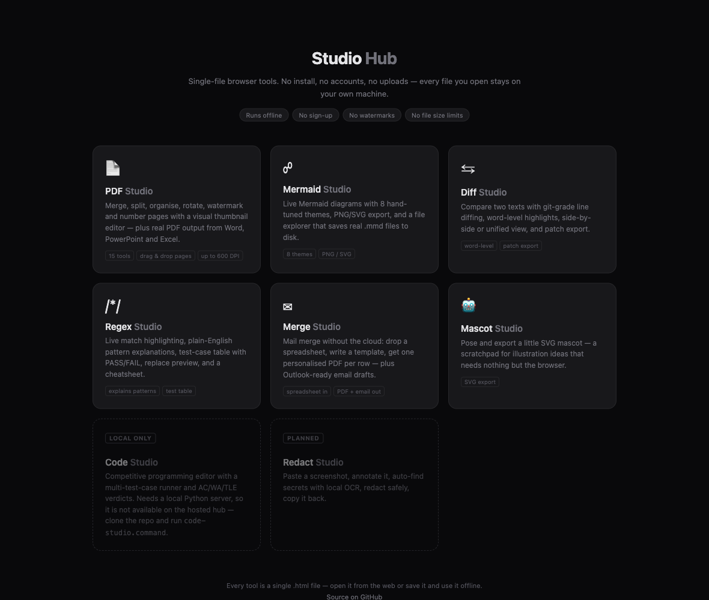

## Why single files?

Every tool here is one self-contained `.html` file: open it from disk, it works — even offline. That's not a gimmick, it's the point:

- **Privacy by architecture.** You can't responsibly paste work code, internal configs, or secrets into an online diff checker or regex tester. A local file with no network calls removes the question entirely.
- **Nothing to break.** No dependencies to update, no service to shut down, no subscription to lapse. These files will open in 2040.
- **Trivially portable.** Email a tool to a colleague; it still works.

## The tools

### ⇆ Diff Studio — [`diff-studio.html`](diff-studio.html)

Compare two texts with a patience diff (the same algorithm family git uses) and **word-level highlighting** inside changed lines. Side-by-side or unified view, ignore-whitespace/case options, "changes only" collapsing for long files, drag-and-drop file loading, and one-click export as a unified `.patch`.

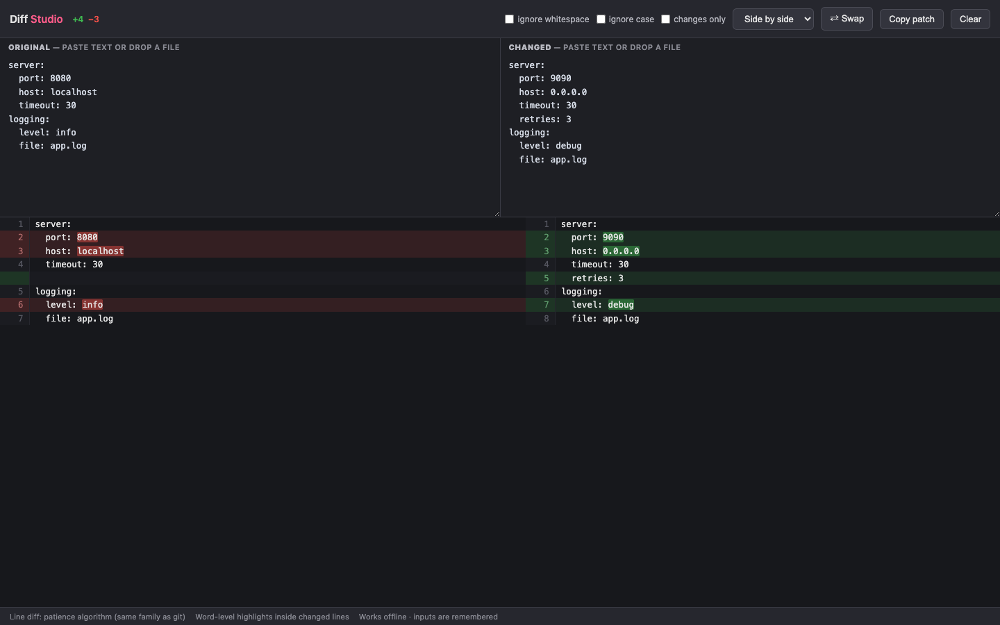

### /\*/ Regex Studio — [`regex-studio.html`](regex-studio.html)

Live match highlighting, numbered and named capture groups, a replace preview, and a **plain-English explanation** of your pattern generated by a built-in regex parser. Keep a table of test cases with should-match / should-not-match expectations and live PASS/FAIL badges. Runaway patterns (catastrophic backtracking) are killed after 1.5 s instead of freezing the tab.

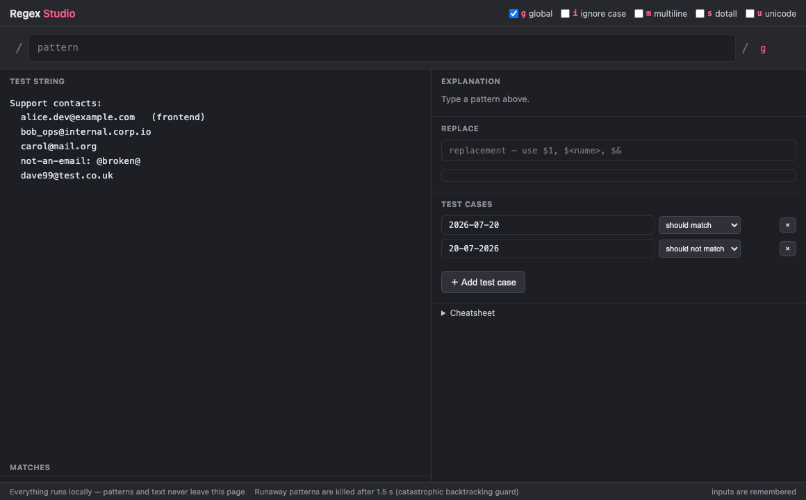

### ⌁ Mermaid Studio — [`mermaid-live.html`](mermaid-live.html)

Live Mermaid diagram editor with 8 hand-tuned themes, high-resolution PNG/SVG/clipboard export, and a file explorer that saves real `.mmd` files to a folder on disk. Also maintained standalone at [rajathpi/mermaid-studio](https://github.com/rajathpi/mermaid-studio).

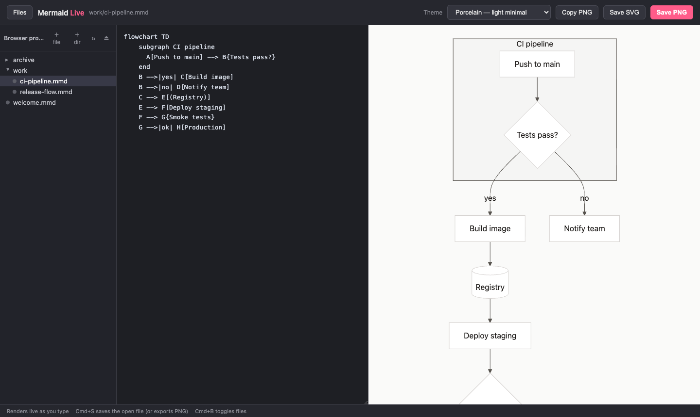

### ✉ Merge Studio — [`merge-studio.html`](merge-studio.html)

Mail merge without the cloud. Drop a **CSV/XLSX** (or paste cells straight from Excel), write a document template with `{{placeholders}}`, and get **one personalized PDF per row** — or one per person, with `{{#each}}` tables and `{{sum:…}}` totals when several rows belong to the same record. Everything renders locally; salary data, client lists, and HR files never touch a server.

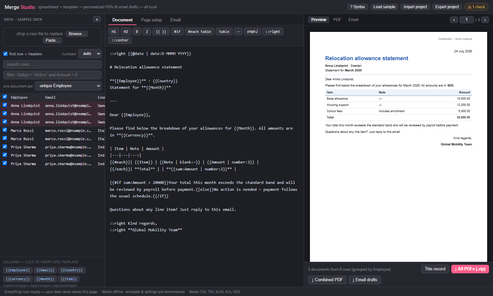

The template language covers real documents, not just letters: filters (`{{Salary | currency:EUR}}`, `date:`, `number:`, `blank:`), conditional blocks (`{{#if Status = "Active"}}…{{else}}…{{/if}}`), tables, page breaks, headers/footers with page numbers, a logo, and custom fonts (drop a `.ttf` for full Unicode). A live preview shows each record as you type — switch to the PDF tab for the real rendered output — and a checks panel flags typo'd field names (with did-you-mean), empty values, and filename collisions before you generate.

The whole flow — load the built-in sample, flip through records, edit the template with the preview following along, check the real PDF, download everything as a zip:

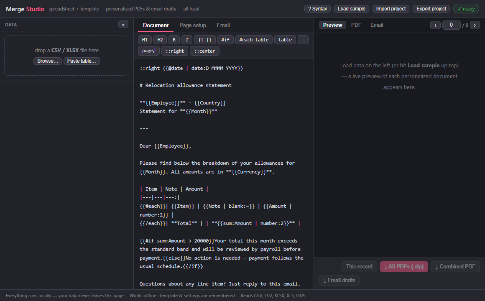

Output: individual PDFs zipped, one combined PDF, or **`.eml` email drafts** (with the PDF attached) that open ready-to-send in Outlook / Apple Mail — review each one, hit send. Nothing is ever sent for you. Row filters (`Amount > 0 and Status = Active`), per-row include checkboxes, EU/US number-format handling, and project export/import round it out.

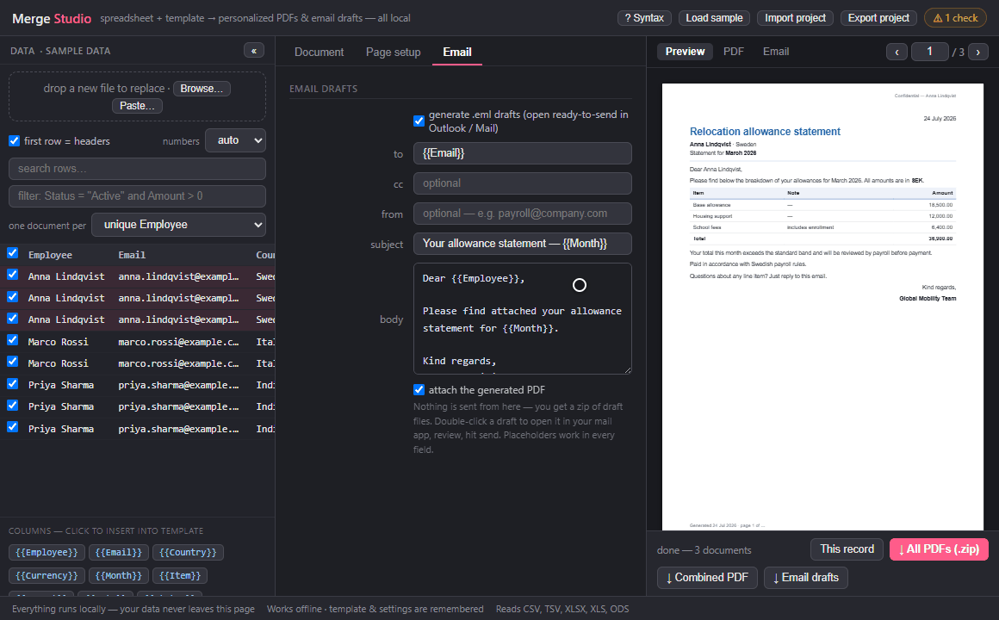

### 📄 PDF Studio — [`pdf-studio.html`](pdf-studio.html)

Fifteen PDF operations behind one file manager: merge, split, remove, extract, reorder, rotate, page numbers, watermark, metadata, images ↔ PDF, and an Office bridge for Word, PowerPoint and Excel. Drop in a mix of PDFs, images and Office files and every operation that applies to them lights up.

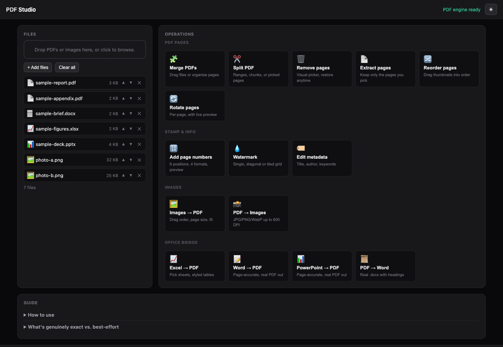

**Pages are edited visually, not by typing ranges.** Merge, reorder, remove, extract, rotate and split all share one thumbnail grid: drag a page to move it — across files, not just within one — click to select, rotate individual pages or a whole selection, and drop pages you don't want. Removed pages stay greyed out rather than vanishing, so you can put them back before saving. Nothing is written until you hit save.

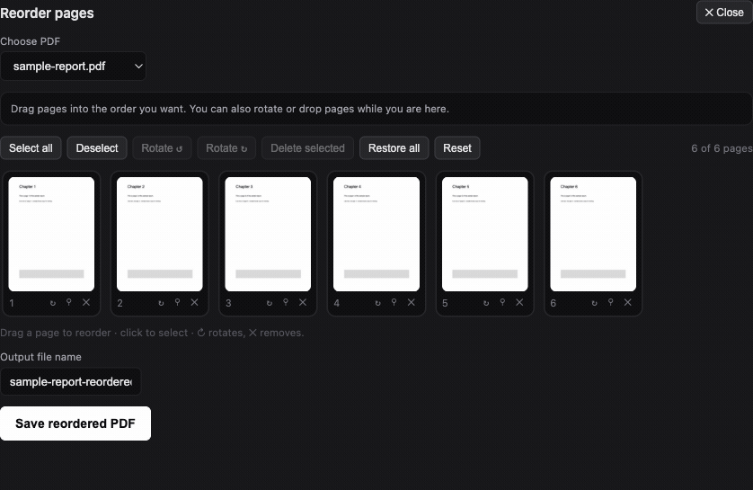

The same grid is what every page operation opens onto — here it is mid-edit, with one page turned a quarter-turn, one flipped upside down, one dropped, and one selected:

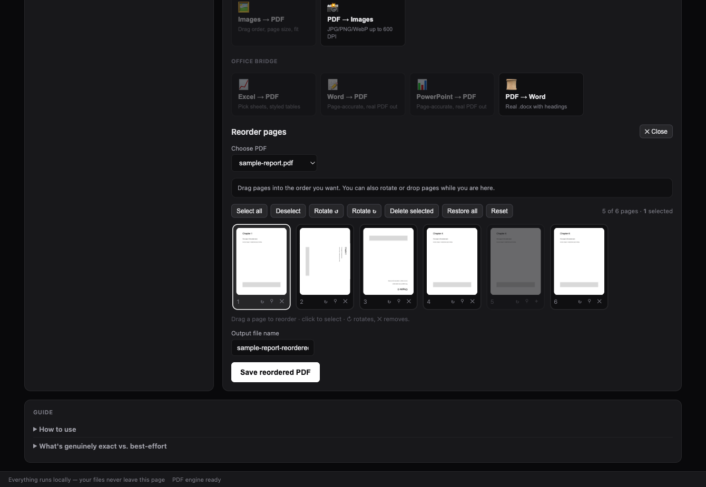

Split builds on it too: give it ranges (`1-3, 5, 8-10`, shown as removable chips), a fixed chunk size, one file per page, or a visual pick — and get either separate PDFs in a zip or one merged document.

**Stamping shows you the result before you commit.** Page numbers offer six positions, four formats (`1`, `i`, `Page 1`, `1 of 10`), a start-at offset, skip-the-cover, colour and weight — rendered live onto page one as you change them.

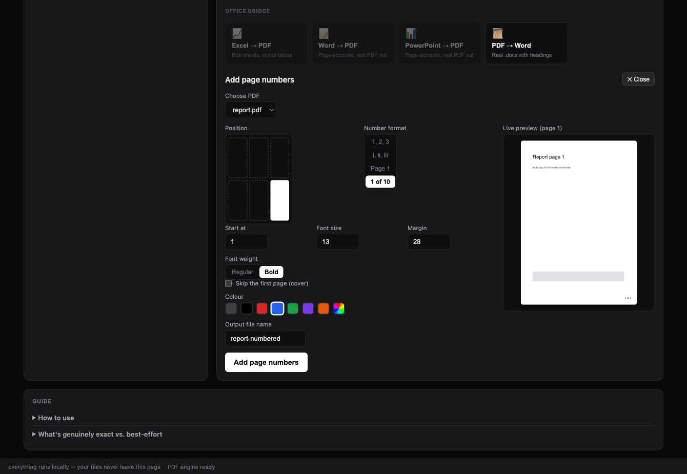

Watermarks come as a single stamp, a diagonal run, or a tiled grid, with size, opacity, rotation and colour on live sliders.

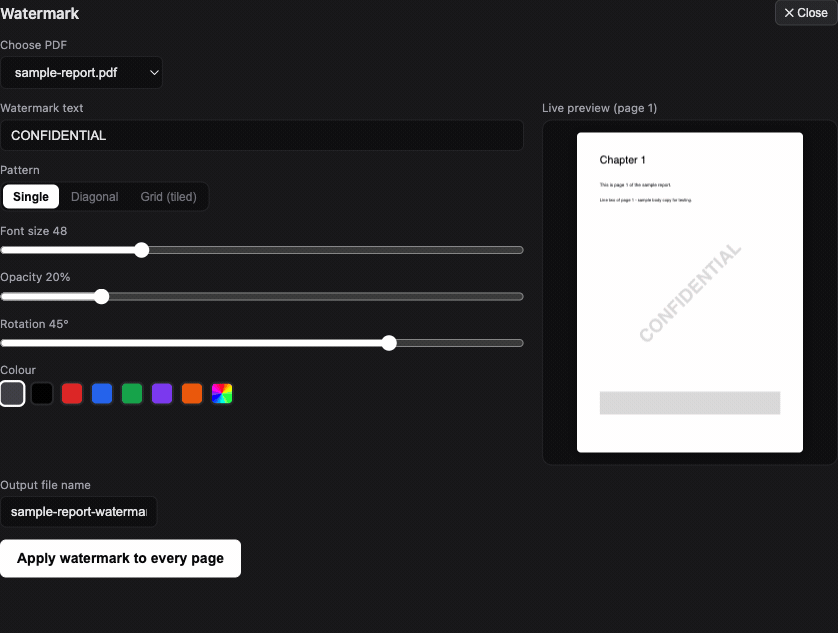

**The Office bridge writes real PDFs.** Word documents are laid out with their own page size, margins, styles, tables and images and then written directly to a PDF — no print dialog, no "save as PDF" detour. PowerPoint decks are rebuilt at the deck's real slide size with their text and embedded pictures. Excel renders each sheet you tick as a paginated table with repeated headers.

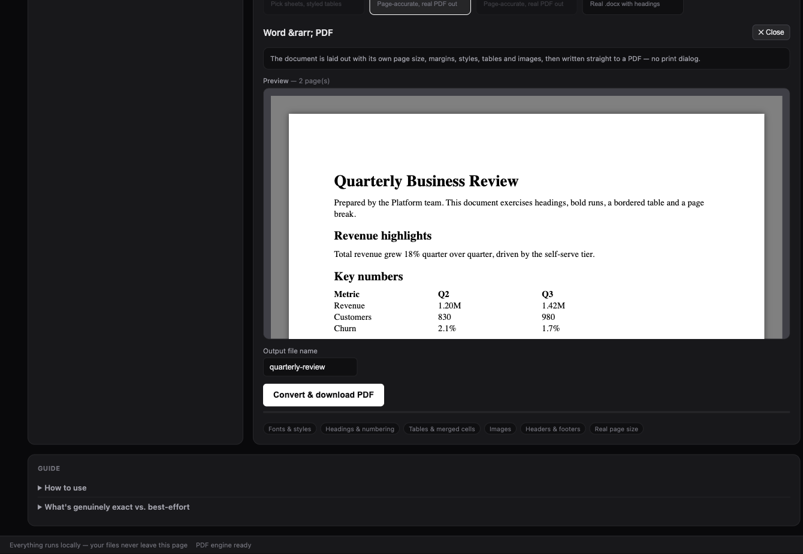

Going the other way, **PDF → Word** produces a genuine `.docx`: heading levels are inferred from font sizes, bold runs and font families are carried over, and each PDF page becomes a page break. **PDF → images** renders JPG, PNG or WebP at DPI presets from screen (150) to archival (600), for all pages, the first page, a custom range, or a visual selection.

### 🤖 Mascot Studio — [`mascot-studio.html`](mascot-studio.html)

A small scratchpad for posing and exporting an SVG mascot — handy for a quick illustration when you don't want to open a design tool.

### ▶ Code Studio — [`code-studio.py`](code-studio.py) + [`code-studio.html`](code-studio.html)

A competitive-programming workbench: editor with tabs and per-language templates, a file explorer over a real workspace folder, and a **multi-test-case runner** with AC / WA / TLE / RE verdicts and per-test timing.

This is the one tool that isn't browser-only — browsers can't run compilers — so it ships with a tiny local runner (pure Python stdlib, nothing to install) that detects the toolchains on your machine (C++, C, Python, Node, Java, Go, Rust), compiles and runs your code with time limits, and serves the UI at `http://127.0.0.1:8137`. It binds to localhost only and requires a per-session token. On macOS it also ships a `bits/stdc++.h` shim so classic CP code compiles under Apple clang.

```bash
./code-studio.command                              # macOS: double-click works too
python3 code-studio.py                             # any OS
python3 code-studio.py ~/path/to/your/cp-folder    # use an existing folder as workspace
```

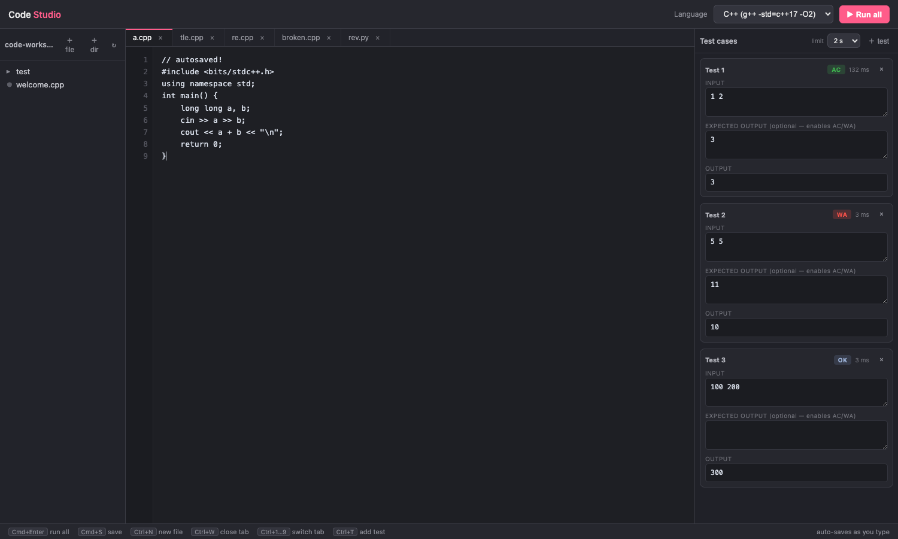

## Getting started

The quickest path is the hosted hub — [rajathpi.github.io/studio-hub](https://rajathpi.github.io/studio-hub/) — which serves the same files straight from `main`.

To run them locally instead:

```bash
git clone https://github.com/rajathpi/studio-hub.git
cd studio-hub
open index.html        # or just double-click it
```

Each tool remembers its inputs between sessions (localStorage). Every tool except Code Studio is pure browser code, so once a page has loaded it keeps working with the network off.

### Browser notes

- Everything works in any modern browser.
- Mermaid Studio's **Open folder…** (real files on disk) uses the File System Access API: Chrome, Edge, and Arc have it enabled; **Brave** ships it disabled — enable `brave://flags/#file-system-access-api` and relaunch. Safari/Firefox fall back to an in-browser project.
- PDF Studio loads its PDF, Office and rasterising libraries from a CDN on first open, so that one needs a connection the first time (the page is cached afterwards). Every other browser tool is fully self-contained.
- Code Studio requires Python 3 (preinstalled on macOS and most Linux distros) for its local runner. It is the one tool the hosted hub can't run, since it needs a compiler on your machine.

## License

[MIT](LICENSE)
